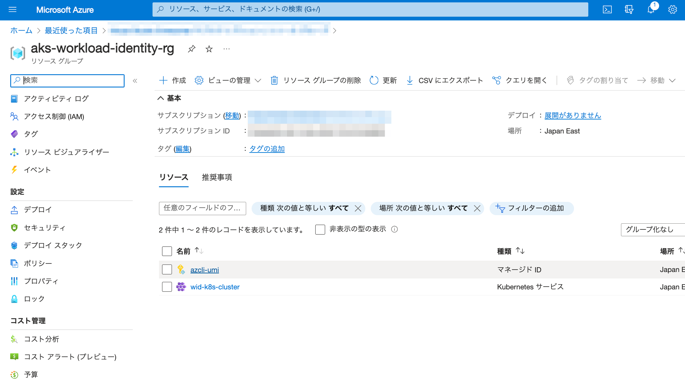

# aks-workload-identity-inspection

## Overview
Workload Identity on Azure Kubernetes Service (AKS) を試すためのリポジトリです。(2023 年 10 月 26 日時点で動作確認済み)
このリポジトリでは、Workload Identity の資格情報により、Azure CLI でのサインインができるところまでの検証を行います。

### 事前にインストールが必要なツール
- azure CLI (v2.47.0 以降 -> [公開情報](https://learn.microsoft.com/ja-jp/azure/aks/workload-identity-deploy-cluster) より)
  - インストール手順は [こちら](https://learn.microsoft.com/ja-jp/cli/azure/install-azure-cli)
- Terraform
  - インストール手順は [こちら](https://developer.hashicorp.com/terraform/tutorials/aws-get-started/install-cli)

## how to start
1. Terraform を利用して、Azure リソースをデプロイします
```
terraform -chdir=./azure init
terraform -chdir=./azure apply
```

出力結果をメモします (出力結果の一部は 3. の手順にて使用します)

> Outputs:
>
> aks_cluster_name = "wid-k8s-cluster"
> 
> client_id_for_helm = "00000000-0000-0000-0000-000000000000"
> 
> namespace_for_helm = "azcli"
> 
> resource_group = "aks-workload-identity-rg"
> 
> service_account_name_for_helm = "azcli-sa"

2. ローカル環境にて Kubernetes クラスタを操作できるようにします

```
# (optional) install kubectl if not installed yet
az aks install-cli --client-version 1.27.3

# set up kubeconfig
az aks get-credentials -g aks-workload-identity-rg -n wid-k8s-cluster
```

4. Helm (Terraform Provider) で Azure CLI Pod をインストールする

```
terraform -chdir=./helm init
terraform -chdir=./helm apply
```

4. マネージド ID に Azure ロールを付与する

    4-1. Azure portal へアクセス

    4-2. リソース グループ "aks-workload-identity-rg" へ移動

    4-3. "azcli-umi" (マネージド ID) のリソースを選択する

    

    4-4. アクセス制御 (IAM) へ移動し、 [追加] > [ロールの割り当ての追加] よりマネージド ID に付与するロールを指定する

    

5. Azure CLI Pod でのリソース操作を試す（4-4. の手順にてロールのアクセス許可が付与されるまで時間がかかる可能性があります）

```
// open azure CLI pod with shell
$ kubectl exec -it $(kubectl get po -n { 1. の手順の namespace_for_helm } --no-headers | awk '{ print $1 }') -n { 1. の手順の namespace_for_helm } -- sh

// login with pod workload identity (= managed ID)
/ # az login --federated-token "$(cat $AZURE_FEDERATED_TOKEN_FILE)" --service-principal -u $AZURE_CLIENT_ID -t $AZURE_TENANT_ID
```

6. 下記のような出力が確認できれば、Workload Identity によるサインインが成功しています
```
/ # az login --federated-token "$(cat $AZURE_FEDERATED_TOKEN_FILE)" --service-principal -u $AZURE_CLIENT_ID -t $AZURE_TENANT_ID
[
  {
    "cloudName": "AzureCloud",
    ...
    "homeTenantId": "00000000-0000-0000-0000-000000300000",
    "id": "00000000-0000-0000-0000-000000400000",
    "isDefault": true,
    "managedByTenants": [
      {
        "tenantId": "00000000-0000-0000-0000-000000500000"
      }
    ],
    "name": "Your Subscription",
    "state": "Enabled",
    "tenantId": "00000000-0000-0000-0000-000000300000",
    "user": {
      "name": "00000000-0000-0000-0000-000000600000",
      "type": "servicePrincipal"
    }
  }
]
```
